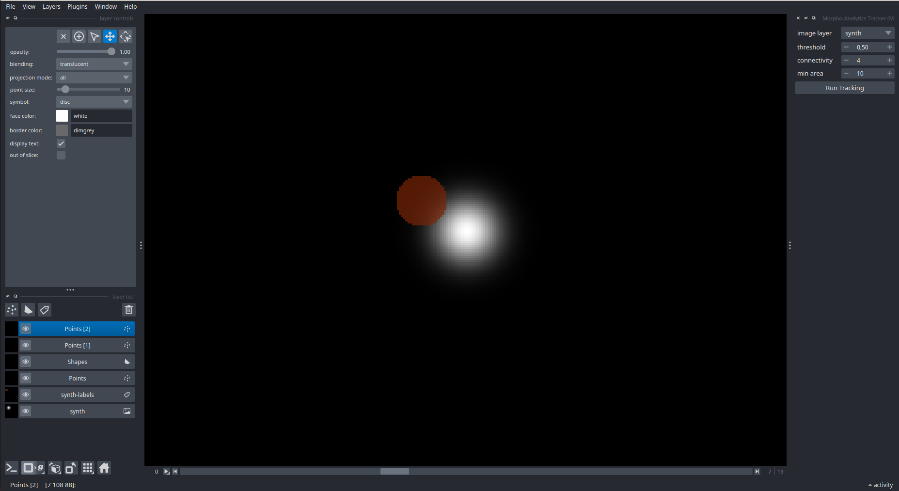

# Morpho-Analytics
An advanced tool for object tracking and morpho-dynamic analysis in image sequences.
## Quickstart with Docker
`docker run --rm -v "$PWD/examples":/data eliotsystem/morpho-analytics:latest report /data/synth.npy --out /data/report.json --fig /data/report.png`
## Example Output

## License
Please see the [End-User License Agreement](./EULA.md) for terms of use.
