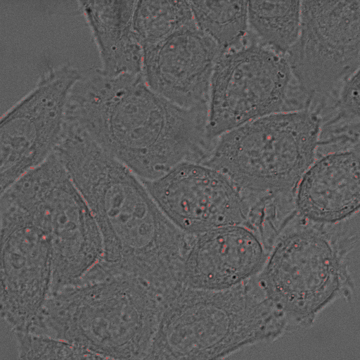

# Morpho-Analytics

**From data to proof in 30 seconds**  
A Docker-ready command-line tool for object tracking and morpho-dynamic analysis on image sequences.

---

## 🎬 Demo Animation

  
*(This GIF illustrates the transformation: command → visual result + metrics.)*

---

## Proofs & Visual Validation

### Overlay proof (red overlay on image)  


### Centroids over time (object positions across frames)  


---

## Quickstart with Docker

Run the analysis in minutes from the root of the project:

```bash
docker run --rm -v "$PWD/examples":/data eliotsystem/morpho-analytics:v0.1.9 report /data/synth.npy --out /data/report.json --fig /data/report.png
